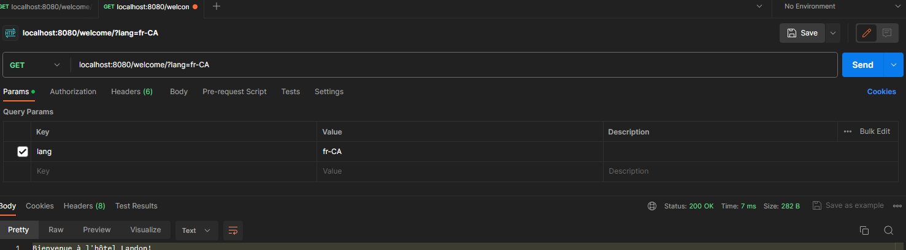

<strong> **DO NOT DISTRIBUTE OR PUBLICLY POST SOLUTIONS TO THESE LABS. MAKE ALL FORKS OF THIS REPOSITORY WITH SOLUTION CODE PRIVATE. PLEASE REFER TO THE STUDENT CODE OF CONDUCT AND ETHICAL EXPECTATIONS FOR COLLEGE OF INFORMATION TECHNOLOGY STUDENTS FOR SPECIFICS. ** </strong>

# WESTERN GOVERNOR UNIVERSITY 
## D387 – ADVANCED JAVA

## Outline

              [ X ] indicates complete

              File Name: #
              Line Number:  #
              Change:  #

##  A.  Create your subgroup and project in GitLab using the provided web link and the "GitLab How-To" web link by doing the following:

 -[X]  Clone the project to the IDE.

 -[X]   Commit with a message and push when you complete each requirement listed in parts B1, B2, B3, and C1.

    Note: You may commit and push whenever you want to back up your changes, even if a requirement is not yet complete.

-[X]   Submit a copy of the GitLab repository URL in the "Comments to Evaluator" section when you submit this assessment.

[Git](https://gitlab.com/wgu-gitlab-environment/student-repos/mensahTribeWeb/d387-advanced-java/-/tree/nick-dev?ref_type=heads)

-[X]   Submit a copy of the repository branch history retrieved from your repository, which must include the commit messages and dates.

[Repository Graph](https://gitlab.com/wgu-gitlab-environment/student-repos/mensahTribeWeb/d387-advanced-java/-/network/nick-dev?ref_type=heads)

## B.  Modify the Landon Hotel scheduling application for localization and internationalization by doing the following:

### 1.   Install the Landon Hotel scheduling application in your integrated development environment (IDE). Modify the Java classes of application to display a welcome message by doing the following:

  - [X] a.  Build resource bundles for both English and French (languages required by Canadian law). Include a welcome message in the language resource bundles.
 
      File Name: welcome.properties, welcome_en_US.properties, welcome_fr_CA.properties
      Line Number:  1
      Change: Add: B1A - resource bundles for both English and French, including a welcome message built into the language resource bundles.

- [X]    b.  Display the welcome message in both English and French by applying the resource bundles using a different thread for each language.

         File Name: WelcomeMessageProvider.java
         Line Number:  1-23
         Change:  Add: B1B - create a class to reads properties files, then adds them to JSON array

         File Name: WelcomeController.java
         Line Number:  1-39
         Change:  Add: B1B - Controller to display a welcome message in both English and French 

          File Name: WelcomeResponse.java
          Line Number:  1-13
          Change:  Add: B1B - Response for welcome messages

          from here I wanted to write the code according to demonstrations in order to avoid errors
          
          Spring: 

          File Name: D387SampleCodeApplication.java
          Line Number:  8
          Change:  Add: B1B - @CrossOrigin(origins = "http://localhost:4200") to set the mode of request

          File Name: ApiConfig.java
          Line Number:  12-21
          Change:  Add: B1B - Keeping enpoints secure by adding WebMvcConfigurer Bean

          File Name: DisplayWelcomeMessage.java
          Line Number:  1-26
          Change: Add: B1B -  added  logic for displaying the welcome message, javadocs included 

          File Name: WelcomeController.java
          Line Number:  1-36
          Change:  Add: B1B - Controller which retrieves a welcome message based on the specified language. 

          Angular:

          File Name: app.component.html
          Line Number:  54-58
          Change:  Add: B1B Inject Welcome component HTML into app.component

          File Name: app.module.ts
          Line Number:  12
          Change:  Add: B1B Inject Welcome component into app.component 

          File Name: app.module.ts
          Line Number:  12
          Change:  Add: B1B Inject Welcome component into app.component

          File Name: welcome.component.html, welcome.component.ts,
          Line Number:  1-5
          Change: Add: B1B  Html to  be injected into app.component.html, Classes with lifecycle hooks and methods

### API Test:

### Test Welcome of Both English and French  Language:

 

### Test English Language:

 

###  Test French Language:

 

### Results:

 

### 2.  Modify the front end to display the price for a reservation in currency rates for 

-[X]  U.S. dollars ($)
-[X]  Canadian dollars (C$)
-[X]  euros (€) 

Note: It is not necessary to convert the values of the prices.

          File Name: app.component.html, app.component.ts
          Line Number:  146-161
          Change: Add: B1B functionality to display the price for a reservation in currency rates for 
               U.S. dollars ($), Canadian dollars (C$), and euros (€) on different lines. 
### Results:

3.  Display the time for an online live presentation held at the Landon Hotel by doing the following:

   -[X] a.  Write a Java method to convert times between

   -[X] eastern time (ET)
   -[X] mountain time (MT) 
   -[X] coordinated universal time (UTC) zones.

                 File Name: TimeConverter.java, TimeController.java, date-time-format-postman.png
                 Line Number:  1-37, 1-26
                 Change: Add: B3A - converts the time between eastern time, mountain time, and coordinated universal time zones, then test with postman.

### Results:

     

-[X] b.  Use the time zone conversion method from part B3a to display a message stating the time in all three times zones in hours and minutes for an online, live presentation held at the Landon Hotel. The times should be displayed as ET, MT, and UTC.

             File Name: app.component.html, app.module.ts, time.component.html, time.component.ts, time.component.css
             Line Number:  67-69, 10/13, 1-4, 1-5
             Change:  Add: B3B Inject html into app.component, declare time component, write html code to be injected, add padding and color -blue

### Results:

   

## C.  Explain how you would deploy the Spring application with a Java back end and an Angular front end to cloud services and create a Dockerfile using the attached supporting document "How to Create a Docker Account" by doing the following:

-[X] 1. Build the Dockerfile to create a single image that includes all code, including modifications made in parts B1 to B3. Commit and push the final Dockerfile to GitLab.

            File Name: Dockerfile
            Line Number:  1-32
            Change:  #

##### BUILD DOCKERFILE Photo

#### Docker Container Photo

#### Docker IMAGE

-[ ] 2.  Test the Dockerfile by doing the following:

  -[ ] Create a Docker image of the current multithreaded Spring application.

  -[ ]  Run the Docker image in a container and give the container a name that includes **D387_010195113**.

  -[ ] Submit a screenshot capture of the running application with evidence it is running in the container.

-[X] 3.  Describe how you would deploy the current multithreaded Spring application to the cloud. Include the name of the cloud service provider you would use.

[Deploying Multithreaded Spring Application to AWS Cloud](https://docs.google.com/document/d/e/2PACX-1vQQIu1GCq91c6RRIiQb-YW1GgwuEhRlW6lU_h4_gz0uVk4gMrX8OLsoAa6GUny0796ydPZ2ujJN3Nz1/pub)

### **Backup-link**

https://docs.google.com/document/d/1CIDYu9Tluj0iJWwyg8udTEdJaXYknsbkyZvCpUcmcgQ/edit?usp=sharing
